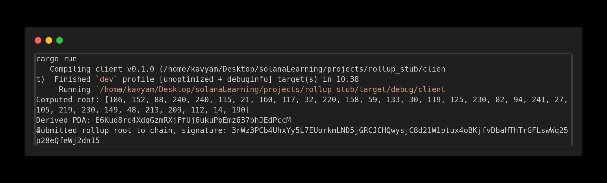
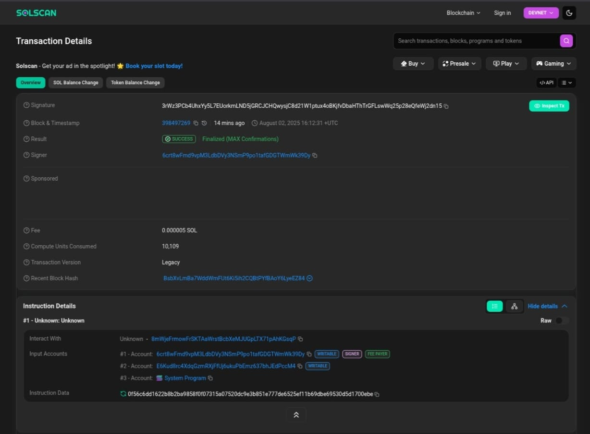

# Basic Rollup
This project is a minimal demonstration of a rollup architecture on Solana, using Anchor for the on-chain program and Rust for the off-chain client. The rollup system submits Merkle roots to the chain, like you can understand it as instead of storing every user's state on-chain, we can compute a merkle tree of user balances or anything and can submit just the merkle root to the program. Now anyone can prove thier state using a merkle proof without needing the full on chain data.

## Overview
- Anchor Program: A smart contract that takes and stores a submitted **merkle root**, storing it in a user-specific account and which is determined by a deterministic PDA.

- Rust Client: It simulates a state update off-chain, and computes the merkle root, then submits that root to the on-chain program.

## Setup

1. Clone the repository
```
git clone https://github.com/Kym0211/rollup_stub
cd rollup_stub
```
2. Build and Deploy the program
```
anchor build
anchor deploy
```
3. Run the client code 
```
cd client
cargo run
```

## Outcome

1. Merkle root calculated - 

2. SolScan Account - 
